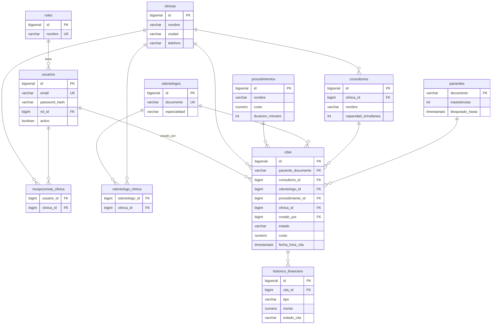

# Clínicas Dentales

API de citas (`citas-api`) + servicio de notificaciones (`notification-service`) + PostgreSQL, orquestados con Docker Compose.

Los JWT se firman con **RS256** (par de llaves RSA). La llave privada **no está en el repo**: cada quien la genera una vez (paso obligatorio antes de correr).

## Requisitos

- Java 17 (Maven va incluido vía el wrapper `./mvnw`)
- Docker + Docker Compose
- `ssh-keygen` y `openssl` (ambos vienen con Git Bash en Windows)

## 1. Generar llaves JWT (una sola vez)

Desde la raíz del repo, en Git Bash:

```bash
cd citas-api/src/main/resources/certs
ssh-keygen -t rsa -b 2048 -m PEM -f rsa_tmp -N "" -C ""    # genera RSA-2048 (PKCS#1)
openssl pkcs8 -topk8 -nocrypt -in rsa_tmp -out private.pem  # privada -> PKCS#8 (BEGIN PRIVATE KEY)
openssl rsa -in rsa_tmp -pubout -out public.pem            # pública -> SPKI  (BEGIN PUBLIC KEY)
rm -f rsa_tmp rsa_tmp.pub
```

Resultado: `certs/private.pem` y `certs/public.pem`. Ambos están en `.gitignore`.

> Sin `openssl` puedes usar solo `ssh-keygen` (requiere OpenSSH moderno):
> ```bash
> ssh-keygen -t rsa -b 2048 -f private.pem -N "" -C ""
> ssh-keygen -p -P "" -N "" -m PKCS8 -f private.pem    # privada -> PKCS#8
> ssh-keygen -e -m PKCS8 -f private.pem > public.pem   # pública -> SPKI
> rm -f private.pem.pub
> ```

## 2. Correr

**Con Docker (todo el stack):**
```bash
docker compose up --build
```
Las llaves generadas en el paso 1 se empaquetan en la imagen al hacer build.

**Solo `citas-api` en local** (necesita Postgres; lo más fácil es `docker compose up postgres`):
```bash
cd citas-api
./mvnw spring-boot:run
```

### Variables de entorno

Todas tienen default para correr en local; sólo hace falta tocarlas en Docker/producción.

| Variable | Servicio | Default | Para qué |
|---|---|---|---|
| `DB_URL` | citas-api | `jdbc:postgresql://localhost:5432/citas` | Conexión JDBC a Postgres |
| `DB_USER` | citas-api | `citas` | Usuario de la BD |
| `DB_PASSWORD` | citas-api | `citas` | Contraseña de la BD |
| `SERVER_PORT` | citas-api / notification | `8080` / `8081` | Puerto HTTP |
| `JWT_PRIVATE_KEY` | citas-api | `classpath:certs/private.pem` | Llave privada RS256 (firma) |
| `JWT_PUBLIC_KEY` | citas-api | `classpath:certs/public.pem` | Llave pública RS256 (verificación) |
| `NOTIFICACIONES_URL` | citas-api | `http://localhost:8081` | Base URL del notification-service |

## 3. Probar

**Login** (admin precargado, token RS256 válido 6 h):
```bash
curl -s -X POST http://localhost:8080/auth/login \
  -H "Content-Type: application/json" \
  -d '{"email":"admin@mail.com","password":"admin"}'
```
Devuelve `{"accessToken":"<jwt>"}` con header `{"alg":"RS256"}`. Úsalo como `Authorization: Bearer <accessToken>` en los endpoints protegidos.

**Registrar un recepcionista** (solo ADMIN):
```bash
curl -s -X POST http://localhost:8080/auth/register \
  -H "Authorization: Bearer <accessToken>" \
  -H "Content-Type: application/json" \
  -d '{"nombre":"Ana","email":"ana@mail.com","password":"ana123"}'
```

> Renovar el access token: `POST /auth/token` con `-d "refreshToken=<jwt>"`.

## Producción

No commitees `private.pem`. Móntala como secreto y apunta las rutas por variable de entorno:

```
JWT_PRIVATE_KEY=file:/run/secrets/private.pem
JWT_PUBLIC_KEY=file:/run/secrets/public.pem
```
(Por defecto son `classpath:certs/private.pem` y `classpath:certs/public.pem`.)

## Credenciales sembradas

Cargadas por migración al arrancar (ver `db/migration`):

| Rol | Email | Password | Origen |
|---|---|---|---|
| ADMIN | `admin@mail.com` | `admin` | seed `V3` |
| RECEPCIONISTA | `recepcion@mail.com` | `recepcion` | seed demo `V7`, asociado a la "Clínica Central" |

## Modelo de datos (ER)



## Supuestos

- El esquema lo gestiona Flyway (`ddl-auto=validate`): las migraciones `V1..V7` corren solas al arrancar.
- Las contraseñas se guardan con bcrypt (pgcrypto `crypt`/`gen_salt('bf')`), no en texto plano.
- JWT firmado con RS256; access token válido 6 h (`app.jwt.expiration-hours`), renovable con `POST /auth/token`.
- Dos roles: `ADMIN` y `RECEPCIONISTA`. Registrar usuarios es exclusivo de ADMIN.
- Los pacientes se identifican por `documento` (sin id autogenerado); acumulan inasistencias y pueden quedar bloqueados temporalmente (`bloqueado_hasta`).
- Estados de cita: `AGENDADA`, `EN_CURSO`, `ATENDIDA`, `CANCELADA`, `INASISTENCIA`, `PENDIENTE_APROBACION`, `RECHAZADA`.
- Los datos demo (1 clínica, 1 consultorio, 1 odontólogo, 2 procedimientos, 1 recepcionista) son sólo para arranque local.
