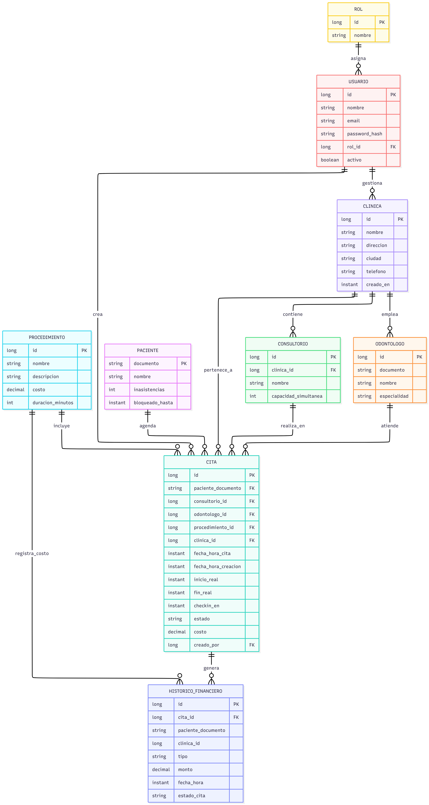

# Clínicas Dentales

API de citas (`citas-api`) + servicio de notificaciones (`notification-service`) + PostgreSQL, orquestados con Docker Compose. Reto técnico para Nelumbo Consultores.

Los JWT se firman con **RS256** (par de llaves RSA). La llave privada **no está en el repo**: cada quien la genera una vez (paso obligatorio antes de correr).

## Stack y arquitectura

- **Java 17** + **Spring Boot 4.1** (Maven vía el wrapper `./mvnw`)
- **Spring Security**: OAuth2 Resource Server, JWT **RS256**
- **Spring Data JPA / Hibernate** sobre **PostgreSQL 16**
- **Flyway** para el esquema y los datos (migraciones `V1..V9`)
- **RestClient** para consumir el `notification-service`
- **Docker + Docker Compose**

```
clinicas-dentales/
├── citas-api/             # API principal: toda la lógica de negocio + acceso a PostgreSQL (puerto 8080)
├── notification-service/  # Microservicio de notificaciones; registra y responde (puerto 8081)
├── postman/               # Colección Postman documentada
├── assets/                # Diagramas
├── docker-compose.yml     # Orquesta postgres + citas-api + notification-service
└── README.md
```

`citas-api` concentra la lógica; cuando un paciente queda bloqueado por inasistencias, llama al `notification-service` vía RestClient.

## Requisitos

- Java 17 (Maven va incluido vía el wrapper `./mvnw`)
- Docker + Docker Compose
- `ssh-keygen` y `openssl` (ambos vienen con Git Bash en Windows)

## 1. Generar llaves JWT (una sola vez)

Desde la raíz del repo, en Git Bash:

```bash
cd citas-api/src/main/resources/certs
ssh-keygen -t rsa -b 2048 -m PEM -f rsa_tmp -N "" -C ""    # genera RSA-2048 (PKCS#1)
openssl pkcs8 -topk8 -nocrypt -in rsa_tmp -out private.pem  # privada -> PKCS#8 (BEGIN PRIVATE KEY)
openssl rsa -in rsa_tmp -pubout -out public.pem            # pública -> SPKI  (BEGIN PUBLIC KEY)
rm -f rsa_tmp rsa_tmp.pub
```

Resultado: `certs/private.pem` y `certs/public.pem`. Ambos están en `.gitignore`.

> Sin `openssl` puedes usar solo `ssh-keygen` (requiere OpenSSH moderno):
> ```bash
> ssh-keygen -t rsa -b 2048 -f private.pem -N "" -C ""
> ssh-keygen -p -P "" -N "" -m PKCS8 -f private.pem    # privada -> PKCS#8
> ssh-keygen -e -m PKCS8 -f private.pem > public.pem   # pública -> SPKI
> rm -f private.pem.pub
> ```

## 2. Correr

**Con Docker (todo el stack):**
```bash
docker compose up --build
```
Las llaves generadas en el paso 1 se empaquetan en la imagen al hacer build. La API queda en `http://localhost:8080` y el microservicio en `http://localhost:8081`.

```bash
docker compose down        # conserva los datos
docker compose down -v     # elimina también la base de datos (reinicio limpio)
```

**Solo `citas-api` en local** (necesita Postgres; lo más fácil es `docker compose up postgres`):
```bash
cd citas-api
./mvnw spring-boot:run
```

### Variables de entorno

Todas tienen default para correr en local; sólo hace falta tocarlas en Docker/producción.

| Variable | Servicio | Default | Para qué |
|---|---|---|---|
| `DB_URL` | citas-api | `jdbc:postgresql://localhost:5432/citas` | Conexión JDBC a Postgres |
| `DB_USER` | citas-api | `citas` | Usuario de la BD |
| `DB_PASSWORD` | citas-api | `citas` | Contraseña de la BD |
| `SERVER_PORT` | citas-api / notification | `8080` / `8081` | Puerto HTTP |
| `JWT_PRIVATE_KEY` | citas-api | `classpath:certs/private.pem` | Llave privada RS256 (firma) |
| `JWT_PUBLIC_KEY` | citas-api | `classpath:certs/public.pem` | Llave pública RS256 (verificación) |
| `NOTIFICACIONES_URL` | citas-api | `http://localhost:8081` | Base URL del notification-service |

## 3. Probar

**Login** (admin precargado, token RS256 válido 6 h):
```bash
curl -s -X POST http://localhost:8080/auth/login \
  -H "Content-Type: application/json" \
  -d '{"email":"admin@mail.com","password":"admin"}'
```
Devuelve `{"accessToken":"<jwt>"}` con header `{"alg":"RS256"}`. Úsalo como `Authorization: Bearer <accessToken>` en los endpoints protegidos.

**Registrar un recepcionista** (solo ADMIN):
```bash
curl -s -X POST http://localhost:8080/auth/register \
  -H "Authorization: Bearer <accessToken>" \
  -H "Content-Type: application/json" \
  -d '{"nombre":"Ana","email":"ana@mail.com","password":"ana123"}'
```

> Renovar el access token: `POST /auth/token` con `-d "refreshToken=<jwt>"`.

## Endpoints

Todos requieren `Authorization: Bearer <token>` salvo `POST /auth/login`. El scope por rol se detalla en la sección de indicadores y consultas.

| Método | Ruta | Rol | Descripción |
|---|---|---|---|
| POST | `/auth/login` | público | Login; devuelve `accessToken` RS256 (6 h) |
| POST | `/auth/register` | ADMIN | Crear recepcionista |
| POST | `/auth/token` | con token válido | Renovar el access token |
| POST | `/auth/logout` | autenticado | Revocar el token actual (queda inválido aunque no expire) |
| GET | `/me/clinicas`, `/me/consultorios` | autenticado | Clínicas/consultorios asociados al usuario |
| CRUD | `/clinicas`, `/consultorios`, `/odontologos`, `/procedimientos` | ADMIN | `GET`, `GET /{id}`, `POST`, `PUT /{id}`, `DELETE /{id}` |
| POST | `/clinicas/{id}/recepcionistas?usuarioId=` | ADMIN | Asociar un recepcionista a la clínica |
| POST | `/citas` | ADMIN / RECEP | Agendar cita (campo opcional `requiereAprobacion`) |
| POST | `/citas/{id}/checkin` | ADMIN / RECEP | Check-in del paciente; pasa a `EN_CURSO` |
| POST | `/citas/registrar-atencion` | ADMIN / RECEP | Cerrar la atención (cobro); pasa a `ATENDIDA` |
| POST | `/citas/{id}/cancelar` | ADMIN / RECEP | Cancelar (cargo 30% si faltan <24 h) |
| POST | `/citas/{id}/no-show` | ADMIN / RECEP | Marcar inasistencia |
| POST | `/citas/{id}/aprobar` y `/rechazar` | ADMIN | Aprobar/rechazar una cita `PENDIENTE_APROBACION` |
| GET | `/citas`, `/citas/dia`, `/citas/buscar`, `/citas/{id}` | ADMIN / RECEP | Consultas de citas (ver más abajo) |
| GET | `/indicadores/...` | según indicador | Indicadores clínicos y financieros (ver más abajo) |
| POST | `/notificaciones/enviar` | ADMIN | Enviar notificación vía notification-service |

## Indicadores y consultas de citas

Capa de lectura. Todos requieren token. Con el seed `V9` devuelven datos no vacíos.

| Método | Ruta | Rol | Qué devuelve |
|---|---|---|---|
| GET | `/indicadores/top-pacientes-red` | ADMIN / RECEP | Top 10 pacientes por atenciones (red, o sus clínicas si es RECEP) |
| GET | `/indicadores/top-pacientes-clinica/{clinicaId}` | ADMIN / RECEP | Top 10 pacientes de una clínica |
| GET | `/indicadores/primera-vez-hoy` | ADMIN / RECEP | Pacientes de hoy sin cita previa en la clínica |
| GET | `/indicadores/ganancias/{clinicaId}` | ADMIN / RECEP | Ganancias hoy/semana/mes/año de la clínica |
| GET | `/indicadores/top-odontologos-mes` | ADMIN | Top 3 odontólogos por atenciones del mes |
| GET | `/indicadores/top-procedimientos-mes` | ADMIN | Top 3 procedimientos más solicitados del mes |
| GET | `/citas/dia?clinicaId=&consultorioId=&fecha=` | ADMIN / RECEP | Citas del día (misma estructura del listado) |
| GET | `/citas?estado=&clinicaId=&fecha=` | ADMIN / RECEP | Listado de citas (agendadas y atendidas), filtros opcionales |
| GET | `/citas/{id}` | ADMIN / RECEP | Detalle de una cita |
| GET | `/citas/buscar?documento=` | ADMIN / RECEP | Búsqueda por coincidencia parcial del documento |

**Scope por rol:** el ADMIN ve toda la red; el RECEPCIONISTA solo sus clínicas asociadas. En los
indicadores "de red" sus resultados se acotan a sus clínicas; al pedir una clínica ajena (indicador
o detalle de cita) recibe **403**; en los listados, las citas de clínicas ajenas no aparecen.

**Interpretaciones:**
- *Atención* = cita en estado `ATENDIDA`; los "top pacientes/odontólogos" cuentan atenciones.
- *Ganancias* = suma de `COBRO_PROCEDIMIENTO` del histórico (los cargos por cancelación tardía no son ganancia).
- *Primera vez hoy* = paciente con cita hoy y sin ninguna cita previa en esa misma clínica.
- *Más solicitados* (procedimientos) = todas las citas del mes, sin importar el estado.
- Periodos (hoy/semana/mes/año) se calculan en zona `America/Bogotá`; la semana empieza el lunes.

```bash
# Ejemplo: ganancias de la clínica 1 (con token ADMIN o del recepcionista de esa clínica)
curl -s http://localhost:8080/indicadores/ganancias/1 -H "Authorization: Bearer <accessToken>"
```

## Reglas de negocio

- **Disponibilidad:** no se agenda si el odontólogo se solapa en horario o el consultorio supera su capacidad simultánea. Los intervalos `[inicio, fin)` son semiabiertos: dos citas que se tocan en el límite no chocan.
- **Sin duplicados:** un paciente no puede tener dos citas activas (`AGENDADA`/`EN_CURSO`) el mismo día en ninguna clínica de la red (zona `America/Bogotá`).
- **Validación:** documento de 6 a 12 dígitos numéricos; la fecha-hora debe ser futura.
- **Costo histórico:** el costo se copia del procedimiento al agendar; si luego cambia la tarifa, las citas previas conservan su precio.
- **Cancelación tardía:** cancelar con menos de 24 h cobra el 30% del costo (`CARGO_POR_CANCELACION_TARDIA` en el histórico).
- **Inasistencias:** 3 no-shows en 90 días bloquean al paciente 30 días y disparan una notificación vía microservicio.
- **Aprobación manual:** con `requiereAprobacion: true` la cita nace `PENDIENTE_APROBACION` y el ADMIN la aprueba o la rechaza (detalle en *Supuestos*). Una cita pendiente **no** reserva el horario.
- **Histórico financiero:** atenciones (cobro) y cancelaciones tardías (cargo) se registran como movimientos para los indicadores.

## Producción

No commitees `private.pem`. Móntala como secreto y apunta las rutas por variable de entorno:

```
JWT_PRIVATE_KEY=file:/run/secrets/private.pem
JWT_PUBLIC_KEY=file:/run/secrets/public.pem
```
(Por defecto son `classpath:certs/private.pem` y `classpath:certs/public.pem`.)

## Credenciales sembradas

Cargadas por migración al arrancar (ver `db/migration`):

| Rol | Email | Password | Origen |
|---|---|---|---|
| ADMIN | `admin@mail.com` | `admin` | seed `V3` |
| RECEPCIONISTA | `recepcion@mail.com` | `recepcion` | seed demo `V7`, asociado a la "Clínica Central" |

## Colección Postman

En `postman/citas-api.postman_collection.json`. Impórtala en Postman: al ejecutar el login (admin) el token queda guardado y el resto de peticiones lo reutilizan.

## Modelo de datos (ER)



## Supuestos

- El esquema lo gestiona Flyway (`ddl-auto=validate`): las migraciones `V1..V9` corren solas al arrancar.
- Las contraseñas se guardan con bcrypt (pgcrypto `crypt`/`gen_salt('bf')`), no en texto plano.
- JWT firmado con RS256; access token válido 6 h (`app.jwt.expiration-hours`), renovable con `POST /auth/token`.
- Logout server-side: el token revocado se guarda en `tokens_invalidados` (seed `V8`) y se rechaza aunque no haya expirado. En producción esa lista viviría en Redis.
- Dos roles: `ADMIN` y `RECEPCIONISTA`. Registrar usuarios es exclusivo de ADMIN.
- Los pacientes se identifican por `documento` (sin id autogenerado); acumulan inasistencias y pueden quedar bloqueados temporalmente (`bloqueado_hasta`).
- El histórico financiero actúa como libro de movimientos (cobros y cargos); la tabla `citas` conserva el estado y sus fechas reales.
- Estados de cita: `AGENDADA`, `EN_CURSO`, `ATENDIDA`, `CANCELADA`, `INASISTENCIA`, `PENDIENTE_APROBACION`, `RECHAZADA`.
- Los datos demo son sólo para arranque local: `V7` siembra la "Clínica Central" (1 consultorio, 1 odontólogo, 2 procedimientos, 1 recepcionista asociado) y `V9` añade citas + histórico financiero y una 2.ª clínica ("Clínica Norte", sin recepcionista) para que los indicadores devuelvan datos y se vea el aislamiento por rol.
- A propósito **no se valida el orden temporal** al marcar inasistencia o cancelar: se puede hacer aunque la cita aún no haya llegado a su hora. Esto facilita probar de una vez el cobro por cancelación tardía, el no-show y el bloqueo sin fabricar citas con fecha pasada. En producción se añadiría un guard que rechace marcar inasistencia/cancelación antes de la hora de la cita.
- **Aprobación manual de citas:** el enunciado da al ADMIN el permiso de aprobar o rechazar citas que requieran validación manual, pero no define qué dispara esa validación. Se resolvió con un campo opcional `requiereAprobacion` en `POST /citas`: si llega en `true`, la cita nace `PENDIENTE_APROBACION` y el ADMIN la resuelve con `POST /citas/{id}/aprobar` (pasa a `AGENDADA`, revalidando disponibilidad porque una cita pendiente no reserva el horario) o `POST /citas/{id}/rechazar` (pasa a `RECHAZADA`). Sin el flag, el agendamiento es directo como siempre.
